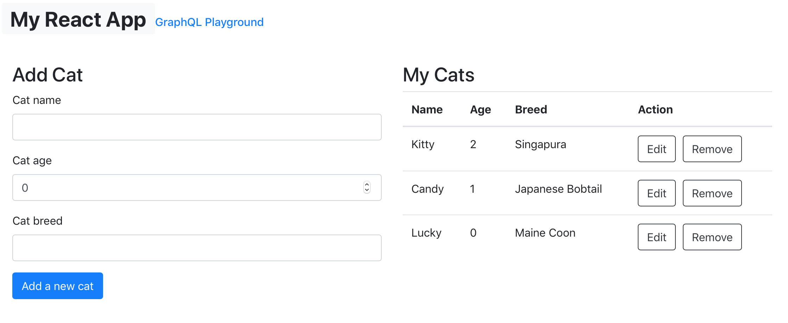
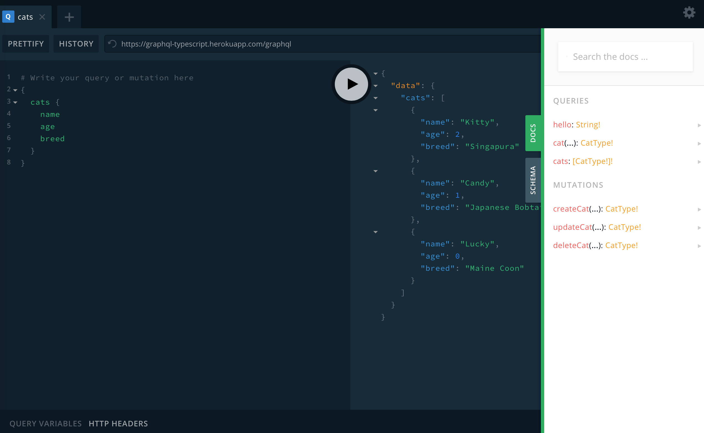

# GraphQL TypeScript React App


## Description

I started this project because I can't find many online resources about how to build a full stack GraphQL application. This application supports CRUD (Create, Read, Update, Delete) operations and it's type-safe, thanks to TypeScript. Also, this application can be a GraphQL starter project for building large full stack applications.

Check out this application on [Heroku](https://graphql-typescript.herokuapp.com).


## Technologies

Frontend:

* [React TypeScript](https://create-react-app.dev/docs/adding-typescript)
* [Apollo Client](https://www.apollographql.com/docs/react)
* [GraphQL Code Generator](https://github.com/dotansimha/graphql-code-generator)

Backend:

* [NestJS](https://nestjs.com)
* [Type GraphQL](https://github.com/MichalLytek/type-graphql)
* [MongoDB](https://www.mongodb.com)


## Installation

```bash
# server
$ yarn

# client
$ yarn client:install
```


## Running the app

```bash
# server
$ yarn start

# client
$ yarn client

# production mode
$ yarn build
$ yarn start:prod
```


## Demo



